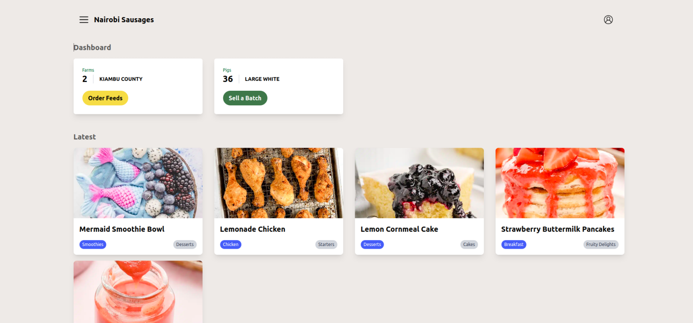
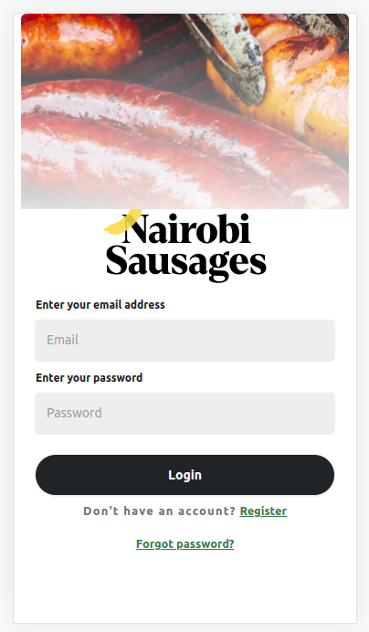
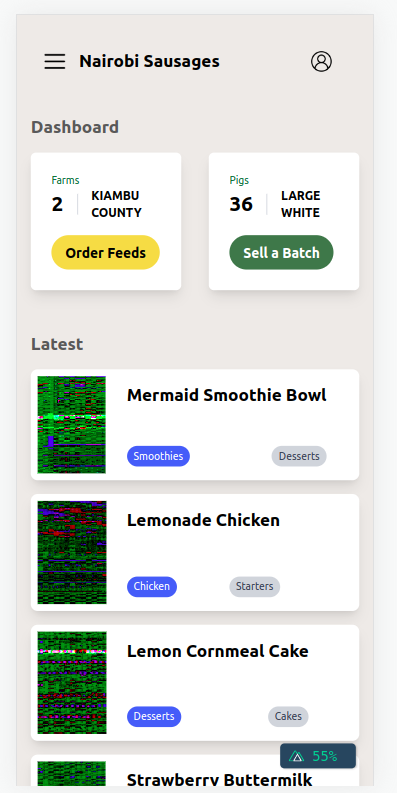

# Nairobi Sausages

Nairobi Sausages is project a web application that connects pig farmers with Nairobi Sausages to facilitate the purchase of feeds and the selling of full-grown pigs. Pig farmers can log in, upload details of their animals, browse and purchase feeds, and eventually sell their pigs to Nairobi Sausages. The pricing of the pigs will vary based on their age and weight.

## Features

- User authentication (login) for pig farmers to log in and access their accounts.
- Ability for pig farmers to upload details of their animals and manage their inventory.
- Feed store for pig farmers to browse and purchase feeds from Nairobi Sausages.
- Dynamic pricing based on the age and weight of the pigs.
- Integration with noblepig.com to display the 5 latest posts from their website.
- Responsive UI design for both large and small screens.

## Technologies Used

- Frontend Framework: Vue.js
- Server-Side Rendering: Nuxt.js
- Styling: Tailwind CSS 

## Screenshots

### Large Screen

### Small Screen

## Getting Started

To run Nairobi Sausages locally, follow these steps:

1. Clone the repository: `git clone https://github.com/zillahmwimali/NairobiSausages..git`
2. Navigate to the project directory: `cd nairobisausages`
3. Install dependencies: `npm install` or `yarn install`
4. Set up environment variables if required.
5. Start the development server: `npm run dev` or `yarn dev`
6. Access the application in your browser at `http://localhost:3000`

## Login credentials
email : farmer@gmail.com
password : !farmer1234

## Contributing

Contributions are welcome! If you have any ideas, bug fixes, or improvements, please submit a pull request. Make sure to follow the existing code style and provide clear commit messages.

## License

This project is licensed under the [MIT License](LICENSE).

## Contact

If you have any questions or inquiries about Nairobi Sausages, feel free to reach out to me at [zillahmwimmali@gmail.com]

Happy farming!
